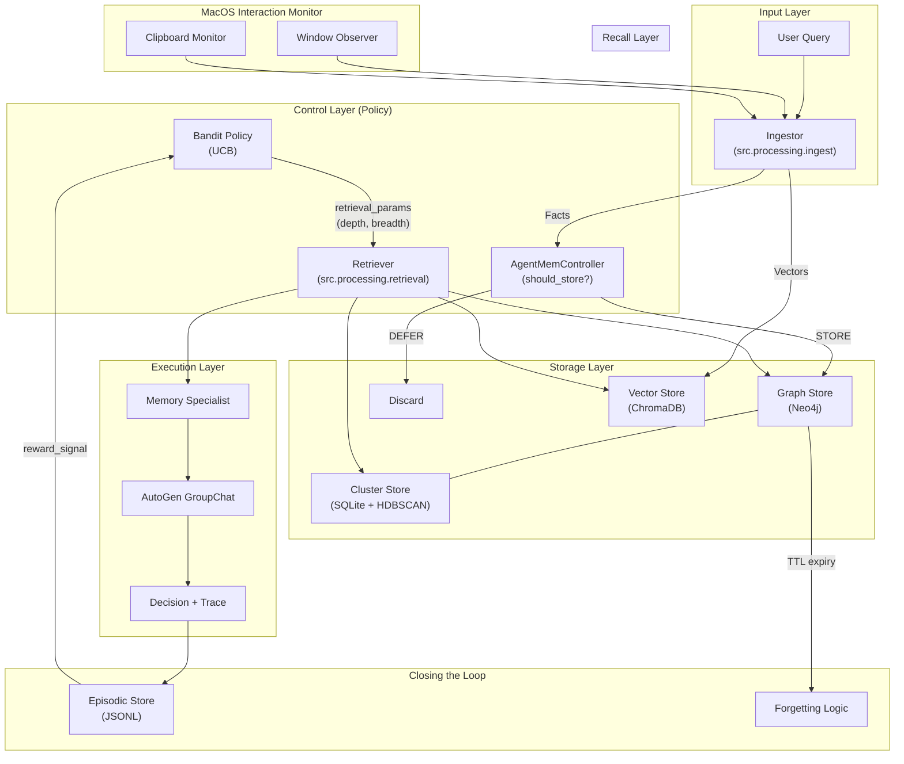
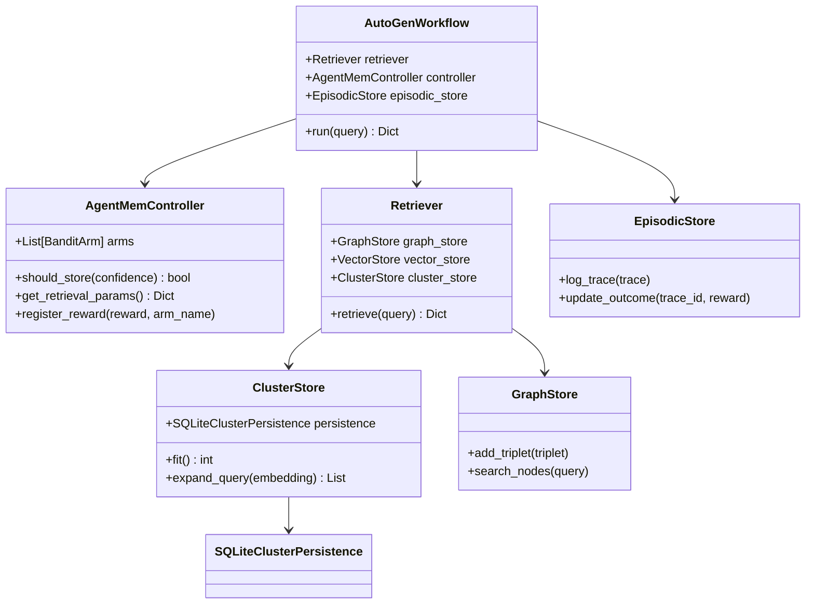
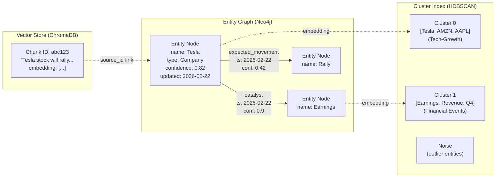
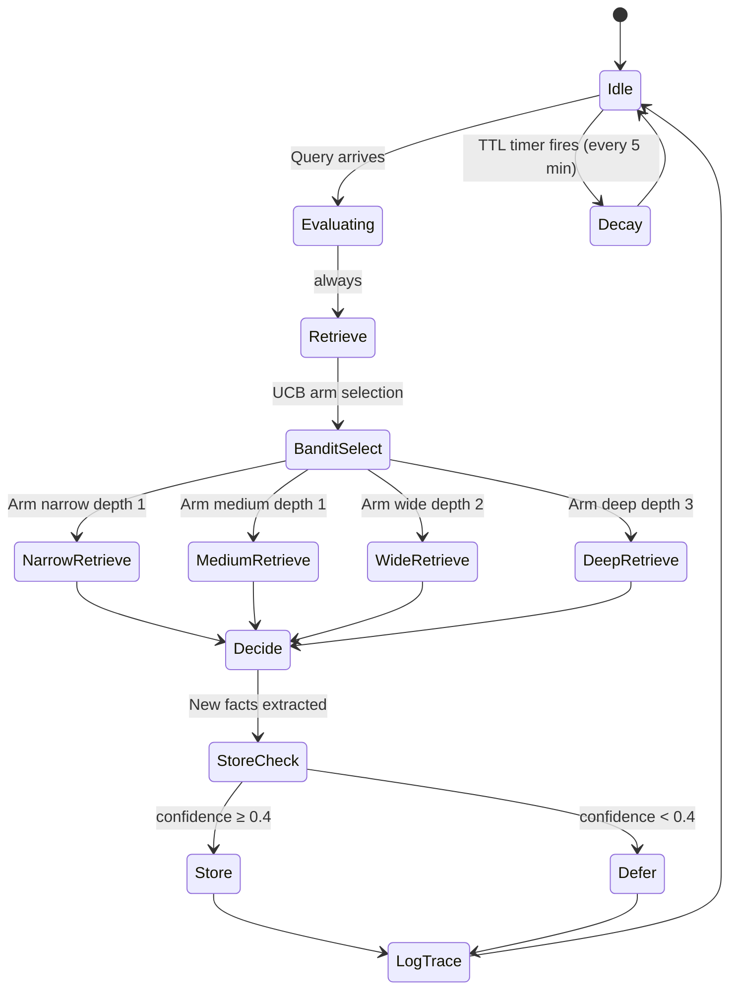
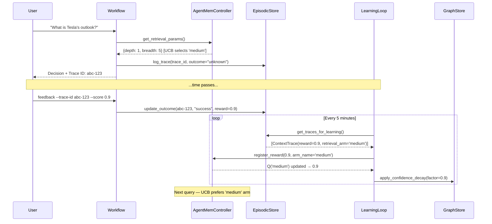
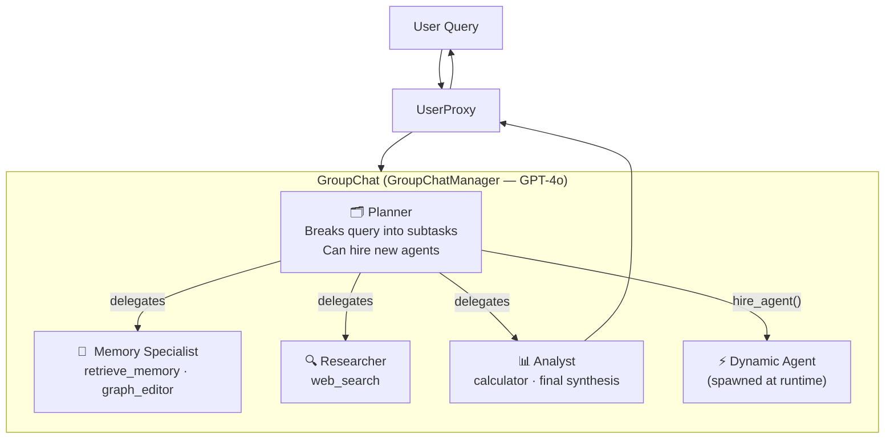

# AgentMem v2 — Self-Improving Agent Memory & Decision System

*Design Document | Version 2.0 | February 2026*

---

## 1. Introduction

Modern AI agents fail under scale not because their reasoning is wrong, but because their memory is wrong. When memory is an unstructured vector blob, there is no causal chain between what was retrieved and what was decided. When there is no causal chain, there is no learning. When there is no learning, every decision is made cold — regardless of how many prior decisions were made correctly or incorrectly on the same subject.

This document describes **AgentMem v2**: a hybrid, self-improving agent memory system that separates memory *representation* (deterministic, structured) from memory *control* (learned, policy-driven). The system combines an entity-centric knowledge graph, soft semantic clustering, and a lightweight reinforcement-style controller — the **AgentMem Controller** — that decides at runtime how much to retrieve, what to store, and what to forget.

The design is production-extendable and weekend-feasible. All components are independently replaceable.

---

## 2. Tenets

*In priority order. When they conflict, higher-order tenets win.*

1. **Auditability above convenience.** Every decision must be reproducible from its trace. A system that cannot explain itself cannot be trusted.
2. **Structure controls learning; learning controls memory.** The knowledge graph is never mutated by gradient descent. Only heuristics and human feedback write to it.
3. **Graceful degradation.** Every advanced subsystem (clustering, bandit) must have a working fallback so the system runs correctly from day one, without any trained components.
4. **Human corrections are first-class memory.** A human correction is not a log entry — it is a new fact that immediately updates the graph and closes the reward loop.

---

## 3. Problem Statement

### 3.1 What Fails Today

| Failure Mode | Root Cause | Consequence |
|---|---|---|
| Stale facts influence decisions | No confidence decay or TTL | Agent acts on outdated knowledge |
| Retrieval noise poisons context | Fixed-depth traversal, no policy | Irrelevant facts crowd out relevant ones |
| No learning from outcomes | Trace logs exist but are never read | Same mistakes repeated indefinitely |
| Human corrections are ignored | Correction is logged, not ingested | Memory permanently wrong |

### 3.2 What Success Looks Like

- A query on a topic with rich history retrieves *more* relevant context than a query on a novel topic — automatically, without manual tuning.
- After 50 decisions, the system's retrieval policy has measurably converged toward configurations that produced better outcomes.
- A human who types a correction sees that correction reflected in graph memory within seconds, not the next training cycle.
- Every decision can be replayed from its context trace, including which memory IDs were retrieved and in what order.

---

## 4. Architecture

### 4.1 High-Level Data Flow (DFD Level 1)



### 4.2 Application UML Diagram (Simplified)



### 4.3 Memory Subsystem Detail



### 4.3 AgentMem Controller State Machine



### 4.4 Self-Improvement Learning Loop



### 4.5 Multi-Agent GroupChat



---

## 5. Component Reference

| Component | File | Responsibility |
|---|---|---|
| Ingestor | `src/processing/ingest.py` | Canonicalize text → entities + triplets |
| GraphStore | `src/memory/graph_store.py` | Neo4j driver; typed, timestamped edges |
| VectorStore | `src/memory/vector_store.py` | ChromaDB client; semantic embedding search |
| ClusterStore | `src/memory/cluster_store.py` | HDBSCAN cluster index; soft expansion |
| EpisodicStore | `src/memory/episodic_store.py` | Append-only trace log with outcome support |
| Retriever | `src/processing/retrieval.py` | 3-phase recall: vector + graph + cluster |
| AgentMemController | `src/agent/agentmem_controller.py` | UCB bandit policy over memory ops |
| LearningLoop | `src/agent/learning_loop.py` | Background TTL decay + reward updates |
| FeedbackManager | `src/agent/feedback.py` | Human corrections → graph write-back |
| MacOSMonitor | `src/processing/macos_monitor.py` | Passive window and clipboard observation |
| AutoGenWorkflow | `src/agent/workflow_autogen.py` | GroupChat orchestration + Provenance tracking |

---

## 6. Data Schemas

### ContextTrace (Full Provenance Record)
```python
class ContextTrace(BaseModel):
    trace_id:            str           # UUID
    task_id:             str
    input_query:         str
    retrieved_memory_ids: List[str]    # IDs of all memory objects retrieved
    retrieved_memories:   List[Dict]    # Full content of retrieved items
    graph_paths:         List[List[str]]
    retrieval_arm:       Optional[str] # The strategy used (narrow, wide, etc.)
    reasoning_steps:     List[str]
    final_decision:      str
    confidence:          float
    outcome:             Literal["success", "failure", "unknown"]
    reward_signal:       float         # [-1.0, 1.0]  ← drives bandit
    timestamp:           datetime
    feedback:            Optional[Feedback]
```

### Triplet (Knowledge Graph Edge)
```python
class Triplet(BaseModel):
    subject:    str     # "Tesla"
    predicate:  str     # "expected_movement"
    object:     str     # "rally"
    timestamp:  str
    confidence: float   # decays over time via LearningLoop
    source_id:  str     # links back to VectorStore chunk
```

---

## 7. Operational Guide

### Quick Start (Local AI — Ollama)

1. **Install Ollama**: [ollama.com](https://ollama.com)
2. **Pull Models**:
   ```bash
   ollama pull llama3.2
   ollama pull nomic-embed-text
   ```
3. **Configure .env**:
   ```bash
   LLM_MODEL=ollama/llama3.2
   EMBEDDING_MODEL=ollama/nomic-embed-text
   ```
4. **Run**:
   ```bash
   ENABLE_MACOS_MONITOR=true python3 start_agent.py
   ```

### Quick Start (Docker — Traditional)

### CLI Reference

```bash
# Interactive real-time mode (with monitors + learning loop)
ENABLE_MACOS_MONITOR=true python3 start_agent.py

# One-off ingestion
python run_agent.py ingest --text "Apple Q4 revenue was $120B"

# One-off query
python run_agent.py query "What is Apple's financial outlook?"

# Submit feedback on a past decision
python run_agent.py feedback --trace-id <uuid> --score 0.9 \
    --correction "Apple is actually in a strong position due to services growth"

# Inspect bandit arm Q-values (in start_agent.py interactive mode)
> bandit
```

### Environment Variables

| Variable | Default | Description |
|---|---|---|
| `OPENAI_API_KEY` | — | Required for LLM calls |
| `NEO4J_URI` | `bolt://localhost:7687` | Graph DB connection |
| `NEO4J_USER` | `neo4j` | Graph DB username |
| `NEO4J_PASSWORD` | `password` | Graph DB password |
| `CHROMA_HOST` | `localhost` | Vector DB host |
| `CHROMA_PORT` | `8000` | Vector DB port |

---

## 8. Self-Improvement Mechanics

### Phase 1 — Heuristics (Active)

The simplest improvement mechanism: old facts decay, high-confidence facts persist.

```
confidence(t) = confidence(t₀) × 0.9ⁿ
```
where *n* = number of decay cycles since last reinforcement. Facts below 0.05 confidence are candidates for deletion.

### Phase 2 — Bandit Learning (Active)

The `AgentMemController` maintains four retrieval arms:

| Arm | Graph Depth | Entity Breadth | Use Case |
|---|---|---|---|
| narrow | 1 | 3 | Simple factual queries |
| medium | 1 | 5 | Standard queries |
| wide | 2 | 10 | Relational queries |
| deep | 3 | 15 | Complex multi-hop queries |

UCB selection formula:
```
arm* = argmax_a [ Q(a) + √(2 ln(N) / n(a)) ]
```
where `Q(a)` is the average reward for arm `a`, `N` is total pulls, `n(a)` is pulls for arm `a`.

### Phase 3 — GRPO / RLVR (Planned)

Offline optimization over episodic trace batches. Reward shaping from outcomes + human feedback. No end-to-end gradient through the memory store.

---

## 9. Complexity Analysis

| Operation | Complexity | Notes |
|---|---|---|
| Entity write | O(log N) | Neo4j B-tree index on name |
| Vector search | O(log N) | ChromaDB HNSW index |
| Graph traversal | O(k·d) | k neighbors per hop, d hops |
| Cluster expansion | O(K) | K = cluster size, bounded |
| TTL decay | O(N) | Full graph scan, runs offline |
| Bandit arm select | O(A) | A = 4 arms, effectively O(1) |

---

## 10. Failure Modes & Mitigations

| Risk | Likelihood | Mitigation |
|---|---|---|
| Memory bloat from ingestion spam | Medium | AgentMem confidence gate (DEFER < 0.4) + TTL decay |
| Retrieval noise corrupts reasoning | Medium | Cluster expansion budget cap (top 5 entities) |
| Bandit feedback loop collapse | Low | Epsilon-greedy exploration (ε = 0.15); offline-only updates |
| Neo4j unavailable at boot | Medium | `depends_on: healthcheck` in `docker-compose.yml` |
| Graph edge proliferation | Low | Relationship deduplication via MERGE in Neo4j Cypher |
| Human feedback poisons memory | Low | FeedbackManager re-canonicalizes correction through same pipeline as ingest |

---

## 11. Testing

```bash
# Run all v2 tests
python -m unittest tests/test_agentmem_v2.py -v

# Run full suite
python -m unittest discover tests/ -v
```

| Test Class | Coverage |
|---|---|
| `TestClusterPersistence`| SQLite save/load, entity recovery |
| `TestRetrievalV2` | Semantic query embedding flow |
| `TestAgentMemController` | store gate, UCB selection, thread-safe reward update |
| `TestLearningLoop` | reward propagation with explicit arm tracking |
| `TestAutoGenSystem` | workflow trace & provenance capture |
| `TestDynamicAgents` | hire_agent creates + adds to GroupChat |

---

## 12. Roadmap

- **v2.1** — [DONE] Persistent ClusterStore (SQLite sidecar for cluster memberships)
- **v2.2** — [DONE] Semantic Cluster Expansion (True query string embeddings)
- **v2.3** — [DONE] MacOS Interaction Monitor (Passive window/clipboard tracking)
- **v3.0** — Phase 3 offline GRPO update over episodic trace batches
- **v4.0** — Multimodal ingestion (image → entity attributes, chart → structured signals)
